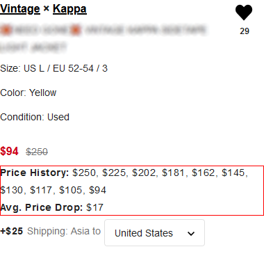
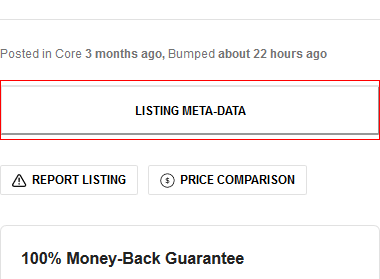

# Grailed Price Checker
Browser Extension for checking an item's price history on grailed.com.

## Current Features
* Price history
* Average price drop
* Full listing meta-data file

#### Feature Screenshots:
| Price History & Drop Average | Listing Meta-Data button (towards bottom of page) |
|---------------|---------------------------------------------------|
||           |

## Installation
#### Firefox
Stable Release Available on the [Firefox Addons Store](https://addons.mozilla.org/en-US/firefox/addon/grailed-plus/).
#### Chromium
Not currently available through any markets, but is compatible with at least Google Chrome, and can be installed manually. See the [releases](https://github.com/RVRX/grailed-plus/releases) pane on the sidebar for downloads.